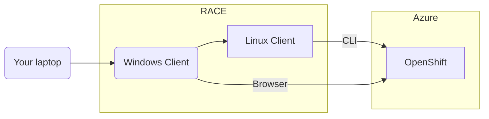

# Access the Lab Environment

* [Environment Overview](#environment-overview)
* [Reserve a Collection of Machines](#reserve-a-collection-of-machines)
* [Connect to the Windows Jump Host](#connect-to-the-windows-jump-host)
* [Next steps](#next-steps)

The SAS Viya environment you use for these hands-on is based in Microsoft Azure. The SAS Viya environment is deployed to an Azure Active Directory tenant that has been created for GEL enablement materials. You will access your SAS Viya environment from a RACE environment composed of a Windows client machine and a Linux host. You will open a Remote Desktop connection to the Windows Client machine and run through the hands-on from this machine. For students using the External Virtual Learning Environment the Remote Desktop connection will be opened for you within the External Virtual Learning Environment.

## Environment Overview

The RACE collection used for the workshop contains the following machines:

* A Linux host with Azure, Kubernetes, and OpenShift command-line interfaces deployed
* A Windows client machine

All access to the environment will be via the Windows client machine.
The resources used for the workshop are based in a workshop specific Azure subscription and all your resources will be within a specific resource group. The resources deployed for you include:

* 8 virtual machines (3 control plane nodes, 5 worker nodes) plus supporting infrastructure (disks, networking, a front-end load-balancer, etc)
* An OpenShift 4.10 cluster deployed on these nodes

## Reserve a Collection of Machines

  > If you are attending this workshop as part of a live class, a collection has already been reserved for you. Skip this step and move to the next one: [Connect to the Windows Jump Host](#connect-to-the-windows-jump-host)

1. [Reserve the Jumphost collection](http://race.exnet.sas.com/Reservations?action=new&imageId=458049&imageKind=C&comment=PSGEL300%20Viya4%20Deploy%20OCP%20VMWare&purpose=PST&sso=PSGEL300&schedtype=SchedTrainEDU&startDate=now&endDateLength=0&discardonterminate=y)
   * A Windows and Linux jumphost are reserved and used to interact with Azure
   * Do not change the text in the Comments field - it is used to drive our automation!
1. In case of problems reserving the collection, see this [troubleshooting page](01_013_Troubleshooting.md).
1. Once the collection has been started, you should receive an email like this:

    

    Note: If,and only if, you are unable to make a reservation from the link above due to machines/servers not being available (this can happen as our machines are quite popular), use the link below to start an environment on RACE Azure. Again, do not change the text in the Comments field! This environment does cost the company $$. Please terminate the reservation as soon as you are done with the workshop.

    Only if there are not enough servers, [book the RACE Azure collection](http://race.exnet.sas.com/Reservations?action=new&imageId=467796&imageKind=C&comment=PSGEL300%20Viya4%20Deploy%20OCP%20Azure&purpose=PST&sso=PSGEL300&schedtype=SchedTrainEDU&startDate=now&endDateLength=0&discardonterminate=y) $$

## Connect to the Windows Jump Host

**We recommend that you wait at least an hour after receiving the email to access the collection.**

1. Using Remote Desktop software, connect to the Windows machine listed in the email

    user: `.\student`

    password: `Metadata0`
1. Wait a few seconds until the logon scripts run - you should see a blue background customized with the name of this workshop:
   
1. In case of problems accessing the Windows Jump Host, see this [troubleshooting page](01_013_Troubleshooting.md).

* From that Windows Jump Host, you can:
  * use the Chrome browser to open a copy of the workshop Hands-on
    
  * use the Chrome browser to perform all exercises that require a browser
  * use MobaXterm to access the Linux Jump Host console
    
* All commands requiring command-line access **are run from a sasnode01 session from within MobaXterm**.

---

## Next steps

* Now you can move to the first workshop exercise: [01 Workshop Introduction / 01 012 Verify the Environment](/01_Workshop_Introduction/01_012_Verify_the_Environment.md)

---

<!-- startnav -->
* [01 Workshop Introduction / 01 011 Access the Environment](/01_Workshop_Introduction/01_011_Access_the_Environment.md)**<-- you are here**
* [01 Workshop Introduction / 01 012 Verify the Environment](/01_Workshop_Introduction/01_012_Verify_the_Environment.md)
* [01 Workshop Introduction / 01 999 Fast track with cheatcodes](/01_Workshop_Introduction/01_999_Fast_track_with_cheatcodes.md)
* [02 OpenShift Introduction / 02 031 Explore OpenShift](/02_OpenShift_Introduction/02_031_Explore_OpenShift.md)
* [04 Deployment / 04 021 Perform the Prerequisites](/04_Deployment/04_021_Perform_the_Prerequisites.md)
* [04 Deployment / 04 022 Prepare for Viya Deployment](/04_Deployment/04_022_Prepare_for_Viya_Deployment.md)
* [04 Deployment / 04 023 Prepare for OpenShift](/04_Deployment/04_023_Prepare_for_OpenShift.md)
* [04 Deployment / 04 024 Customize Viya Deployment](/04_Deployment/04_024_Customize_Viya_Deployment.md)
* [04 Deployment / 04 025 Manually Deploy Viya](/04_Deployment/04_025_Manually_Deploy_Viya.md)
* [04 Deployment / 04 999 Cleanup](/04_Deployment/04_999_Cleanup.md)
* [README](/README.md)
<!-- endnav -->
